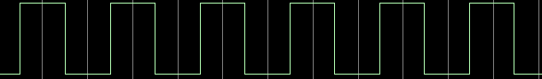
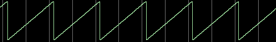
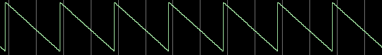
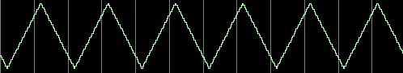
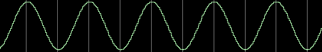
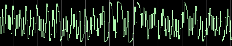
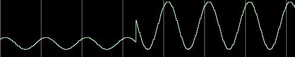

# dds_waveform_generator
> **version: 1.0**
## Description

Verilog IP-core for waveform generations with unsigned output.

IP-core support:

1. Square waveform: 

2. Saw waveform: 

3. Saw reverse waveform: 

4. Triangle waveform: 

5. Sine waveform: 

6. Noise: 

Also, support control output amplitude: 

### Settings
For set output frequency, load frequency code to **i_freq_code**. i_freq_code = (Fout * 2^F_CODE_WIDTH)/Fclk.
> Example: i_freq_code = (1000000 * 2^32) / 60000000 = 71582788 dec = 0x04444444 hex

For select output waveform, load waveform code to **i_signal_selector**.

> **Waveform codes:**
> - 6'b000001 : square;
> - 6'b000010 : triangle;
> - 6'b000100 : saw;
> - 6'b001000 : saw reverse;
> - 6'b010000 : noise;
> - 6'b100000 : sine.

For amplitude control, set amplitude code to **i_amp_value**.
> Min value = 0, Max value = 2^DAC_WIDTH.

### Catalogs structure:
- *doc* - documents;
- *sim_scripts* - .do-files and .sh scripts for Modelsim/Questasim;
- *src* - source files;
  - *hdl* - verilog files;
  - *tables* - sine table files;
- *tb* - testbenches;
